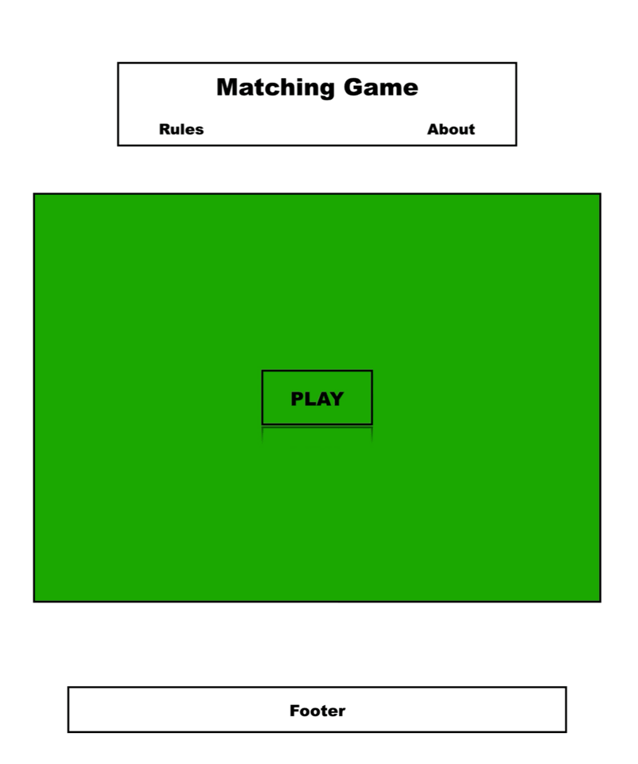
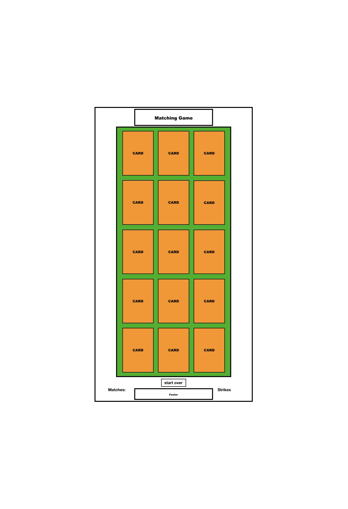

# Match Em Up

## -an incredible use of the Deck of Cards API, by Erinn Nelson

### **[Match Em Up on Surge](https://http://cardmatch.surge.sh/ "A great game of memory")**

### **Project Purpose:**

Match Em Up is a card game built on HTML, CSS and JavaScript that challenges the player to find cards of matching value (ie King matches with a King). Flip over two cards to see if you got a match. If your cards don't match, they go back face down on the table. Can you remember which cards were where? If all cards are matched correctly, the player wins and goes to Disney World!

### **Current Features:**

* Cards animate to flip around and reveal thier value when clicked

* Game recognizes cards with identical values as matches (The suit doesn't matter)

* 10 matches wins the game

* No losers! Play the game until you win and try to beat your lowest strike count

* Cards are fully shuffled between games

* Original graphic design features three randomly selected card colors

* Local storage tracks the player's number of wins, strikes from the previous game, and all-time lowest strike record

* Formatted for portrain and landscape on mobile (iPhone X tested)

* Formatted for portrait mode on tablet (non-tested)

### **Planned Features:**

**New Mechanics**

* Hint System- after five strikes, earn a free peek!

**Local Storage**

* Store the Deck ID so a new deck doesn't have to be created when the page reloads

* Welcome back returning players

* Reset scores with the click of a button

**Animations**

* Dealing cards and removing cards

* Delayed and blinking card-status indicators, shake for incorrect matches

**Sounds**

* Card flip

* Card dealing

* Match

* Incorrect match

* Start button

* New game button

**Misc**

* Emphasize the strike counter when the number rises above 0

* Count strikes from the previous game only if a card was checked

* Create a nicer border/aesthetic for pc play

* Give the New Game button a z-index so its drop shadow is masked by the game board

* Add Rules and About text info

* Reorganize the score box with Strikes and Wins on the left and Lowest Strikes and Strikes from the last successful game on the left

**Known Issues**

* Mobile formatting seperates card front and back images slightly. Tapping to turn a card is problamatic.

* Game board and score box are not centered with each other

### **Wireframes:**

### **Original Stretch Goals:**

**CSS Animations:** Gaze in wonderment as the deck comes to life on your screen! Behold the majesty of cards being dealt and also flipped over!

**JavaScript Local Storage:** Want to keep track of how many games you've won? Who wouldn't!? Maybe one day we can all live in that beautiful reality.